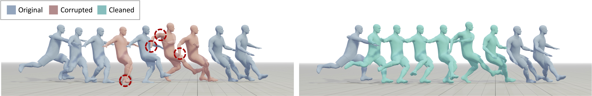

# StableMotion

**StableMotion: Training Motion Cleanup Models with Unpaired Corrupted Data**

You don’t need a clean dataset to train a motion cleanup model. StableMotion learns to fix corrupted motions directly from raw mocap data—no handcrafted data pairs, no synthetic artifact augmentation.



❌ Raw corrupted data 
✅ Clean results!

## Table of Contents
- [StableMotion](#stablemotion)
  - [Table of Contents](#table-of-contents)
  - [Installation](#installation)
    - [Environment Setup](#environment-setup)
    - [Dependencies](#dependencies)
  - [Quick Start](#quick-start)
    - [0. Get BrokenAMASS](#0-get-brokenamass)
    - [1. Training](#1-training)
    - [2. Inference](#2-inference)
  - [Evaluation](#evaluation)
  - [Visualization](#visualization)
  - [Acknowlegements](#acknowlegements)
  - [License](#license)
  - [Citation](#citation)

## Installation

### Environment Setup
Create and activate a new conda environment:

```bash
conda create --name stablemotion python=3.11.8
conda activate stablemotion
```

### Dependencies
Install the required packages:

```bash
# Essential dependencies
pip install numpy==1.23.5
pip install torch==2.4.1 torchvision==0.19.1 --index-url https://download.pytorch.org/whl/cu124
pip install einops
pip install diffusers==0.30.2
pip install ema_pytorch
pip install smplx
pip install blobfile==3.0.0
pip install tensorboard==2.17.1

# For evaluation and visualization
pip install scipy==1.14.1
pip install pytorch_lightning
pip install omegaconf
pip install hydra-core==1.3.2
pip install scikit-learn==1.5.1
pip install trimesh
pip install opencv-python==4.10.0.84
pip install moviepy==1.0.3
pip install matplotlib==3.6.0
pip install pyrender==0.1.45
```

## Quick Start


### 0. Get BrokenAMASS
TODO

### 1. Training
Train the StableMotion model on your corrupted motion data:

```bash
python -m train.train_stablemotion_smpl_glob \
  --save_dir save/stablemotion \
  --data_dir dataset/AMASS_20.0_fps_nh_globsmpl_corrupted_cano \
  --normalizer_dir dataset/meta_AMASS_20.0_fps_nh_globsmpl_corrupted_cano \
  --l1_loss \
  --model_ema \
  --gradient_clip \
  --batch_size 128 \
  --num_steps 1_000_000 \
  --train_platform_type TensorboardPlatform
```

### 2. Inference
Clean up corrupted motion sequences using the trained model:

```bash
# Basic inference
python -m sample.fix_globsmpl \
  --model_path save/stablemotion/ema001000000.pt \
  --use_ema \
  --batch_size 32 \
  --testdata_dir dataset/AMASS_20.0_fps_nh_globsmpl_corrupted_cano \
  --output_dir ./output/stablemotion_vanilla

# Enhanced inference with ensemble and adaptive cleanup
python -m sample.fix_globsmpl \
  --model_path save/stablemotion/ema001000000.pt \
  --use_ema \
  --batch_size 32 \
  --testdata_dir dataset/AMASS_20.0_fps_nh_globsmpl_corrupted_cano \
  --ensemble \
  --enable_sits \
  --classifier_scale 100 \
  --output_dir ./output/stablemotion_hack
```

## Evaluation

Evaluate the quality of cleaned motion sequences:

```bash
python -m eval.eval_scripts --data_path ./output/stablemotion_vanilla/results.npy
```

## Visualization

Generate visual renderings of the cleaned motion data:

```bash
python -m visualize.render_scripts \
  --data_path ./output/stablemotion_vanilla/results.npy \
  --rendersmpl
```

<!-- ## Project Structure

```
StableMotion/
├── train/
│   └── train_stablemotion_smpl_glob.py
├── sample/
│   └── fix_globsmpl.py
├── eval/
│   └── eval_scripts.py
├── visualize/
│   └── render_scripts.py
├── dataset/
│   ├── AMASS_20.0_fps_nh_globsmpl_corrupted_cano/
│   └── meta_AMASS_20.0_fps_nh_globsmpl_corrupted_cano/
├── save/
└── output/
``` -->

## Acknowlegements

We sincerely thank the open-sourcing of these works where our code is based on: 

[MDM](https://github.com/GuyTevet/motion-diffusion-model/tree/main), [stmc](https://github.com/nv-tlabs/stmc.git), [PixArt-α](https://github.com/PixArt-alpha/PixArt-alpha) and [diffusers](https://github.com/huggingface/diffusers)

## License
This code is distributed under an [MIT LICENSE](LICENSE).

Note that our code depends on other libraries, including TMR, SMPL, SMPL-X, and uses datasets which each have their own respective licenses that must also be followed.

## Citation

If you find our work helpful, please cite:

```bibtex
@article{mu2025stablemotion,
  title={StableMotion: Training Motion Cleanup Models with Unpaired Corrupted Data},
  author={Mu, Yuxuan and Ling, Hung Yu and Shi, Yi and Ojeda, Ismael Baira and Xi, Pengcheng and Shu, Chang and Zinno, Fabio and Peng, Xue Bin},
  journal={arXiv preprint arXiv:2505.03154},
  year={2025}
}
```